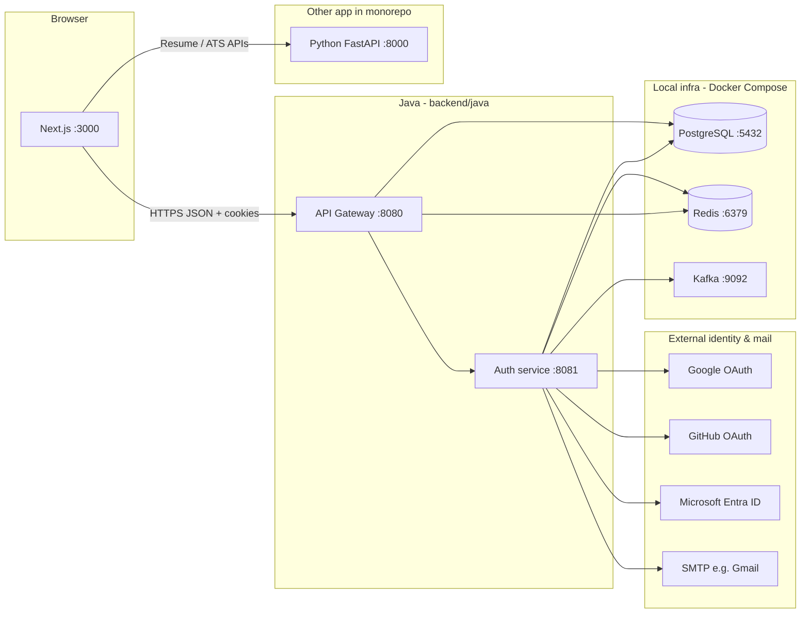

# Jobra Java backend — full developer & integration guide

This document describes **everything** in `backend/java`: services, ports, dependencies, external auth, HTTP APIs, OAuth behaviour, and how **another frontend** or **another backend** can integrate. For a short runbook, see [`README.md`](README.md). For ports across the monorepo, see [`../../PORTS.md`](../../PORTS.md).

---

## 1. Architecture at a glance



**Rule:** Browsers and SPAs should call **`http://localhost:8080` (gateway)** only — not `:8081` directly — so OAuth `redirect_uri`, CORS, and JWT checks stay consistent.

---

## 2. Java services (what we run)

| Service | Port | Role |
|--------|------|------|
| **api-gateway** | **8080** | Single entry for the browser: CORS, JWT/RBAC filter, rate limit, audit, routes `/api/**`, `/oauth2/**`, `/login/**` to authservice. |
| **authservice** | **8081** | Auth domain: users, JWT issue/refresh, OAuth2 login, MFA enrollment, internal APIs. **Not** the public URL for OAuth redirects (those use the gateway host). |

**Startup order:** Start **authservice** first, then **api-gateway** (gateway proxies to `JOBRA_AUTH_SERVICE_URI`, default `http://localhost:8081`).

**Load env:** Always load `.env/local.env` before `mvn spring-boot:run` (see `scripts/load-env.ps1` / `load-env.sh`).

---

## 3. Infrastructure we use (not “auth providers”)

These run via **`docker-compose.yml`** in this `java` folder (or your own instances with matching ports).

| Component | Default port | Used for |
|-----------|--------------|----------|
| **PostgreSQL** | 5432 | Persistent data: users, sessions metadata, etc. (`DB_URL`, `GATEWAY_DATASOURCE_URL`). |
| **Redis** | 6379 | Gateway/session-related usage per configuration (`REDIS_*`, `GATEWAY_REDIS_*`). |
| **Kafka** (+ Zookeeper) | 9092 | Events (e.g. registration notifications via `NotificationEventProducer` → topic `REGISTRATION_TOPIC` / `notification.send`). |
| **Zookeeper** | internal | Kafka dependency; not exposed on host by default. |

---

## 4. External authentication & integrations

### 4.1 OAuth2 social login (browser flow)

Identity is delegated to these **external providers** (configured in `authservice` `application.properties` + env vars):

| Provider | Spring registration id | Env variables | Notes |
|----------|-------------------------|---------------|--------|
| **Google** | `google` | `GOOGLE_CLIENT_ID`, `GOOGLE_CLIENT_SECRET` | Scopes include `openid`, `profile`, `email`. |
| **GitHub** | `github` | `GITHUB_CLIENT_ID`, `GITHUB_CLIENT_SECRET` | Scopes include user + email. |
| **Microsoft Entra ID** | `azure` | `AZURE_AD_CLIENT_ID`, `AZURE_AD_CLIENT_SECRET` | Uses `login.microsoftonline.com/common/...` in repo defaults — **must match** app type in Azure (multi-tenant vs single-tenant; single-tenant needs tenant-specific URLs). |

**Frontend entry URL (always via gateway):**

```http
GET http://localhost:8080/oauth2/authorization/{google|github|azure}
```

**Redirect URI registered at each provider** must match what Spring builds (public host = gateway):

```text
http://localhost:8080/login/oauth2/code/{registrationId}
```

Example for Microsoft: `.../login/oauth2/code/azure`.

The gateway route uses **`PreserveHostHeader`** so authservice sees the **public** host (`:8080`), not `:8081`, when building OAuth redirect URIs.

### 4.2 Email (OTP / notifications)

SMTP via Spring Mail — **`MAIL_HOST`**, **`MAIL_PORT`**, **`MAIL_USERNAME`**, **`MAIL_PASSWORD`** (see `.env/local.env.example`). Used for flows like registration/OTP when configured.

### 4.3 First-party auth (our service)

- **Email + password** registration, OTP verification, login, refresh, logout — all implemented inside **authservice** (not an external IdP), backed by **PostgreSQL**.
- **JWT** access + refresh cookies issued by authservice; **same `JWT_SECRET`** must be configured on **both** authservice and api-gateway so the gateway can validate tokens.

### 4.4 Server-to-server (internal)

- Endpoints under **`/api/auth/internal/*`** are protected by **`X-Internal-Key`** (header) on authservice; gateway treats these paths as **public** (no JWT) so internal callers can reach them with the shared secret **`AUTH_INTERNAL_API_KEY`**.

---

## 5. OAuth behaviour implemented in this repo

1. **Success:** After OAuth, `OAuth2SuccessHandler` creates/updates user, may redirect to **`/verify-otp`**, **`/login?error=mfa_enroll_required`**, or sets **`token`** / **`refreshToken`** cookies and redirects to **`/dashboard`** (see `OAuth2SuccessHandler.java`). Frontend base URL: **`APP_FRONTEND_URL`** (e.g. `http://localhost:3000`).
2. **Failure:** On OAuth failure, authservice redirects to **`{APP_FRONTEND_URL}/login?error=oauth`** and appends **`&reason=...`** (URL-encoded provider error text, length-capped) so the UI can show the real message. Server logs a **WARN** with the full exception.
3. **Missing email from provider:** Redirect **`/login?error=oauth_email`**.

---

## 6. HTTP API reference (authservice — behind gateway)

Base URL for clients: **`{GATEWAY}/api/auth/...`** where `GATEWAY` = `http://localhost:8080`.

| Method | Path | Auth | Purpose |
|--------|------|------|---------|
| POST | `/api/auth/register` | Public | Register (email flow). |
| POST | `/api/auth/verify-otp` | Public | Verify OTP. |
| POST | `/api/auth/resend-otp` | Public | Resend OTP (`email` query param). |
| POST | `/api/auth/login` | Public | Email/password (+ optional MFA) login; sets cookies. |
| POST | `/api/auth/refresh` | Cookie / refresh | Refresh tokens. |
| POST | `/api/auth/logout` | Cookie | Logout. |
| GET | `/api/auth/me` | JWT | Current user (401 if not authenticated). |
| GET | `/api/auth/session` | Optional | **200** always for SPA: `{ authenticated: false }` or user fields — avoids noisy 401 in DevTools when logged out. |
| GET | `/api/auth/users/by-email` | Public (per SecurityConfig) | Lookup by email (used by integrated flows). |
| POST | `/api/auth/internal/subscription` | `X-Internal-Key` | Internal subscription updates. |
| POST | `/api/auth/internal/role` | `X-Internal-Key` | Internal role updates. |
| POST | `/api/auth/mfa/enroll/start` | Public | MFA enrollment start. |
| POST | `/api/auth/mfa/enroll/confirm` | Public | MFA enrollment confirm. |

**Admin (JWT + role):**

| Method | Path | Role |
|--------|------|------|
| GET | `/api/admin/ping` | `ADMIN` or `SUPER_ADMIN` |

**OAuth (browser redirects, not JSON APIs):**

| Path | Purpose |
|------|---------|
| `/oauth2/authorization/{id}` | Start OAuth (`google`, `github`, `azure`). |
| `/login/oauth2/code/{id}` | OAuth callback (handled by Spring Security). |

**Ops:**

| Path | Service |
|------|---------|
| `/actuator/health` | Gateway & authservice (health checks). |

Gateway **JWT filter** skips auth for public patterns listed in `GatewaySecurityPathProperties` (includes `/oauth2/**`, `/login/**`, and the public `/api/auth/*` routes above). **`/api/auth/internal/**`** is public at the gateway but secured by **internal key** on authservice.

---

## 7. How another backend can integrate

### Option A — Call Jobra as a **client** (user context)

If your service runs in the **browser**, use the **same gateway** and send cookies / `Authorization: Bearer <access_token>` as this repo’s frontend does. Obtain tokens via login or OAuth flows hosted on the gateway.

### Option B — **Server-to-server** calls to authservice

- Use **`POST /api/auth/internal/subscription`** or **`POST /api/auth/internal/role`** with header **`X-Internal-Key: <AUTH_INTERNAL_API_KEY>`** (same value in `.env` for authservice).
- Call via **gateway** `http://localhost:8080/...` or directly `http://localhost:8081/...` only in trusted networks (direct bypasses gateway rate limit/CORS but must still send internal key to authservice).

### Option C — Replace or add a **different** auth backend

To swap in another auth implementation:

1. Keep **gateway** as the browser entry or replace it with your own reverse proxy.
2. Preserve **OAuth redirect URLs** (`/login/oauth2/code/{registrationId}`) **on the public host** the browser uses (today **8080**).
3. Align **JWT secret** and claim shape if the gateway must validate tokens the same way (`RbacGlobalFilter` / `GatewayJwtValidator`).
4. Update **`JOBRA_AUTH_SERVICE_URI`** if authservice moves host/port.

---

## 8. Frontend (Next.js) — what to configure

| Variable | Purpose |
|----------|---------|
| **`NEXT_PUBLIC_GATEWAY_URL`** | Base URL for all auth and OAuth starts (default `http://localhost:8080`). Must match gateway. |
| **`NEXT_PUBLIC_RESUME_API_URL`** / **`NEXT_PUBLIC_API_URL`** | Python resume/ATS API (**8000**) — **not** the Java gateway. |

**Patterns:**

- **OAuth:** full-page navigation to `{GATEWAY_URL}/oauth2/authorization/{google|github|azure}` (see `frontend/src/lib/auth-api.ts` — `oauthAuthorizationUrl`).
- **API calls:** `fetch(`${GATEWAY_URL}/api/auth/...`, { credentials: 'include' })` so **HTTP-only cookies** (`token`, `refreshToken`) are sent.
- **Login page query params:** `error=oauth` with optional **`reason`** (provider message); `error=oauth_email`; `error=mfa_enroll_required`; `verified=1` — see `frontend/src/app/login/page.tsx`.

**CORS:** Gateway allows configured origins (`GATEWAY_CORS_ORIGINS` / `gateway.cors.allowed-origins`), e.g. `http://localhost:3000`.

---

## 9. Environment variables (cheat sheet)

Copy from **`.env/local.env.example`** → **`.env/local.env`**. Critical entries:

| Variable | Why |
|----------|-----|
| `JWT_SECRET` | Shared by gateway + authservice (HS256). |
| `APP_FRONTEND_URL` | OAuth redirects after login/failure. |
| `AUTH_INTERNAL_API_KEY` | Internal APIs. |
| `JOBRA_AUTH_SERVICE_URI` | Gateway → authservice URL. |
| `GATEWAY_CORS_ORIGINS` | Browser origins allowed to call gateway. |
| OAuth client IDs/secrets | Google, GitHub, Azure — per provider docs. |

---

## 10. Troubleshooting (quick)

| Symptom | Check |
|---------|--------|
| OAuth error on UI with `reason=` | Provider app registration: redirect URI, tenant vs `/common`, client secret value. |
| CORS errors from `:3000` | `GATEWAY_CORS_ORIGINS`, restart gateway. |
| 401 on protected routes | Token cookie missing/expired; call `/api/auth/login` or refresh. |
| Gateway 502 to auth | Authservice running on `JOBRA_AUTH_SERVICE_URI`. |

---

## 11. Related files (implementation map)

| Area | Location |
|------|----------|
| Gateway routes & CORS | `api-gateway/src/main/resources/application.yml` |
| Gateway JWT / public paths | `api-gateway/.../RbacGlobalFilter.java`, `GatewaySecurityPathProperties.java` |
| Security + OAuth | `authservice/.../SecurityConfig.java`, `OAuth2SuccessHandler.java` |
| Auth REST | `authservice/.../AuthController.java`, `AdminController.java` |
| OAuth user attributes | `authservice/.../oauth/OAuth2UserAttributes.java` |
| Frontend auth client | `frontend/src/lib/auth-api.ts`, `frontend/src/lib/env.ts` |
| Env template | `.env/local.env.example` |

---

*Last updated to reflect: API gateway + authservice split, PostgreSQL/Redis/Kafka, OAuth (Google/GitHub/Azure), internal key APIs, OAuth failure redirect with `reason`, and Next.js integration points.*
